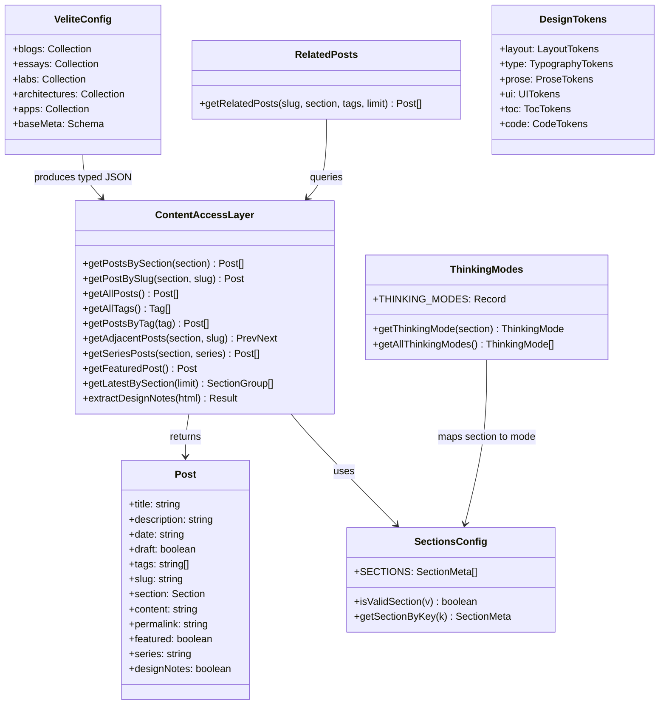
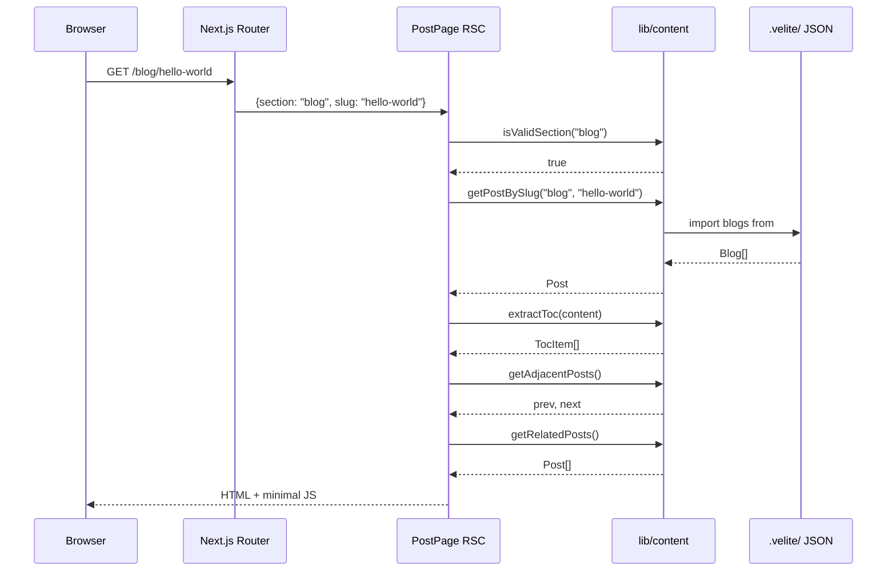
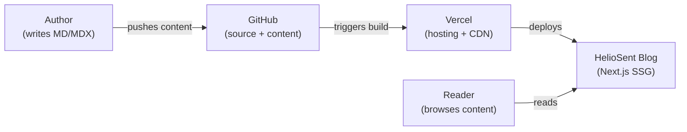
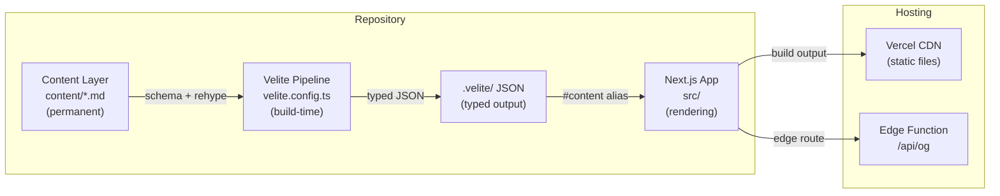
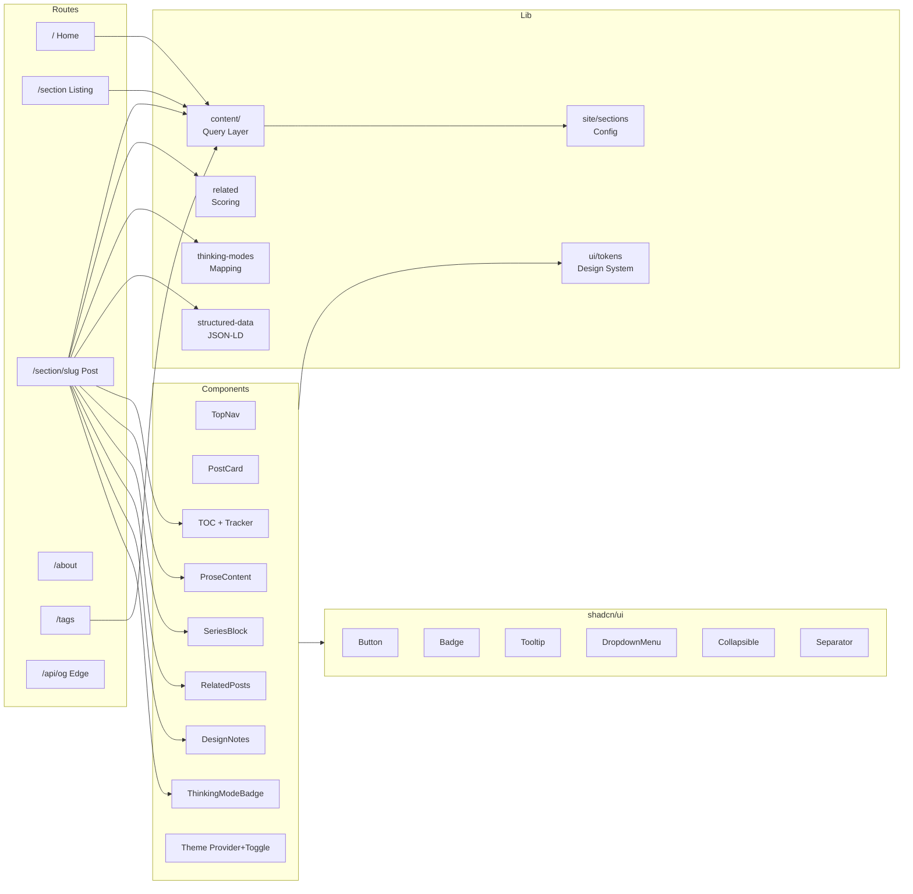

# HelioSent 프로젝트 아키텍처 분석

> **Thinking Mode: Philosophical Mode**
> v1.1 | 생성일 2026-02-16 | 기준 커밋 `b7fe088`

---

## 시스템 컨텍스트

HelioSent은 개인 엔지니어링 지식 시스템입니다. 다섯 가지 인지 모드 — 철학, 실험, 시스템 아키텍처, 제품 실행, 점진적 학습 — 에 걸쳐 구조화된 사고를 기록하며, 영구적 콘텐츠와 교체 가능한 렌더링 인프라를 의도적으로 분리합니다.

아키텍처 기조는 **콘텐츠 주권(content-sovereign)** 입니다. `content/` 디렉터리는 어떤 프레임워크 마이그레이션에서도 살아남도록 설계되었으며, 렌더링 레이어(Next.js)는 명시적으로 교체 가능한 것으로 간주됩니다.

---

## 0. 요약

| 항목 | 평가 |
|------|------|
| **시스템 목적** | "Thinking Modes"를 조직 메타포로 사용하는 구조화된 지식 시스템 |
| **성숙도** | 초기 단계 (v0.1.0). 콘텐츠 파일 4개, 커밋 9개. 핵심 아키텍처 수립 완료 |
| **기술적 리스크** | 복잡도 리스크 낮음. 운영 리스크 높음 — CI/CD 없음, 테스트 없음, 환경 설정 문서 없음 |
| **아키텍처 강점** | 깔끔한 3계층 분리 (Content → Pipeline → Rendering). 잠긴(locked) 디자인 토큰 시스템. 55개 소스 파일 전반의 일관된 패턴 |

---

## 1. 프로젝트 개요

### 시스템 설명

Next.js 16 App Router로 구축된 정적 생성 블로그/지식 베이스입니다. 콘텐츠는 Markdown/MDX로 작성되고, 빌드 타임에 Velite를 통해 타입이 지정된 JSON으로 변환되며, React Server Components를 통해 렌더링됩니다. 다섯 개의 콘텐츠 섹션은 각각 고유한 인지적 자세를 나타내는 "Thinking Mode"에 매핑됩니다.

### 주요 사용 사례

1. 다섯 개 섹션(essays, blog, labs, architecture, apps)에 걸쳐 구조화된 글 발행
2. Thinking Mode 기반 탐색 — 독자가 콘텐츠의 의도를 파악
3. 태그 기반 탐색 — 전체 섹션에 걸친 교차 분류
4. 풍부한 미리보기를 통한 공유 — 포스트별 동적 OG 이미지 생성

### 범위 경계

- 사용자 인증 및 다중 저자 지원 없음
- 데이터베이스 없음 — 모든 데이터는 빌드 타임 정적 생성
- 댓글, 리액션, 소셜 기능 없음
- CMS 없음 — 콘텐츠는 리포지터리 내 파일로 작성
- 검색 기능 없음
- RSS/Atom 피드 없음
- i18n 프레임워크 없음 (한국어 로케일이 유틸리티에 하드코딩)

---

## 2. 기술 스택

| 범주 | 기술 | 근거 |
|------|------|------|
| **언어** | TypeScript 5 (strict) | `tsconfig.json` — `"strict": true` |
| **런타임** | Bun | `bun.lock`, `package.json` scripts |
| **프레임워크** | Next.js 16.1.6 (App Router) | `package.json` |
| **UI 라이브러리** | React 19.2.3 | `package.json` |
| **콘텐츠 파이프라인** | Velite 0.3.1 | `velite.config.ts`, `#content` path alias |
| **스타일링** | Tailwind CSS 4 + PostCSS | `postcss.config.mjs`, `globals.css` |
| **디자인 시스템** | shadcn/ui (new-york style) | `components.json`, `src/components/ui/` |
| **컴포넌트 라이브러리** | Radix UI 1.4.3 | `package.json`, 모든 `ui/` 컴포넌트 |
| **Variant 시스템** | class-variance-authority (cva) | `button.tsx`, `badge.tsx` |
| **클래스 유틸리티** | clsx + tailwind-merge | `src/lib/utils.ts` |
| **테마** | next-themes 0.4.6 | `theme-provider.tsx`, `theme-toggle.tsx` |
| **아이콘** | lucide-react 0.564.0 | TopNav, CopyButton, PostNavigation |
| **구문 강조** | Shiki via @shikijs/rehype | `velite.config.ts` — 듀얼 테마 (github-light/dark) |
| **Markdown 처리** | rehype-slug, rehype-autolink-headings | `velite.config.ts` |
| **애니메이션** | tw-animate-css | `globals.css` |
| **폰트** | Geist + Geist Mono (Google Fonts) | `layout.tsx` |
| **색상 공간** | oklch | `globals.css` — 모든 CSS 변수 |
| **린팅** | ESLint 9 (core-web-vitals + TypeScript) | `eslint.config.mjs` |
| **테스팅** | 미설정 | — |
| **CI/CD** | 미설정 | — |
| **배포** | Vercel (암시적) | `.gitignore`에 `.vercel` 포함 |

---

## 3. 프로젝트 구조

### 루트 레이아웃

```
heliosent-blog/
├── content/                 # 영구 콘텐츠 레이어 (MD/MDX)
│   ├── apps/
│   ├── architecture/
│   ├── blog/
│   ├── essays/
│   └── labs/
├── public/                  # 정적 자산
│   └── static/              # Velite 생성 자산 (해시 적용)
├── src/                     # 애플리케이션 소스
│   ├── app/                 # Next.js App Router (라우트, 레이아웃)
│   ├── components/          # 기능 + UI 컴포넌트
│   │   └── ui/              # shadcn/ui 프리미티브 (Radix 기반)
│   └── lib/                 # 유틸리티, 콘텐츠 접근, 토큰
│       ├── content/         # 콘텐츠 쿼리 레이어
│       ├── site/            # 섹션 정의
│       └── ui/              # 디자인 토큰
├── .velite/                 # 빌드 출력 — 타입이 지정된 콘텐츠 JSON (gitignored)
├── velite.config.ts         # 콘텐츠 스키마 및 파이프라인 설정
├── next.config.ts           # Next.js 설정 (비어 있음 — 기본값)
├── components.json          # shadcn/ui 설정
├── tsconfig.json            # TypeScript (strict, path aliases)
├── postcss.config.mjs       # Tailwind CSS 4
└── eslint.config.mjs        # ESLint (Next.js presets)
```

### 모듈 경계

| 레이어 | 디렉터리 | 책임 | 의존성 방향 |
|--------|----------|------|------------|
| **Content** | `content/` | 원본 Markdown/MDX 파일 | 독립적 — 코드 import 없음 |
| **Pipeline** | `velite.config.ts` → `.velite/` | 스키마 검증, 타입 생성, HTML 변환 | 콘텐츠를 읽고 타입이 지정된 JSON 생성 |
| **Data Access** | `src/lib/content/` | Velite 출력에 대한 쿼리 함수 | `#content` (`.velite/`)에서 import |
| **Domain Logic** | `src/lib/` | 섹션, Thinking Mode, 관련 포스트, 토큰 | 순수 함수, 프레임워크 의존 없음 |
| **UI Primitives** | `src/components/ui/` | shadcn/ui 컴포넌트 (Radix 래퍼) | `@/lib/utils`에만 의존 |
| **Feature Components** | `src/components/` | 블로그 전용 컴포넌트 | lib + ui에 의존 |
| **Routes** | `src/app/` | 페이지, 레이아웃, API 라우트 | components + lib 조합 |

---

## 4. 개발 워크플로

### 설치

```bash
bun install
```

### 명령어

| 명령어 | 설명 |
|--------|------|
| `bun run dev` | Velite 감시자 + Next.js 개발 서버 (동시 실행) |
| `bun run build` | Velite 콘텐츠 빌드 → Next.js 정적 빌드 |
| `bun run start` | 프로덕션 빌드 서빙 |
| `bun run lint` | ESLint 검사 |

### 환경 변수

| 변수 | 용도 | 기본값 |
|------|------|--------|
| `NEXT_PUBLIC_SITE_URL` | 메타데이터/OG/JSON-LD용 기본 URL | `https://heliosent.com` |
| `SHOW_DRAFTS` | 초안 포스트 표시 (`"true"`로 활성화) | 미설정 |
| `NODE_ENV` | 프로덕션에서 초안 표시 여부 제어 | `production` |

`.env.example` 파일이 존재하지 않습니다.

### 배포

CI/CD 워크플로가 설정되어 있지 않습니다. Vercel Git 통합을 통한 암시적 배포입니다.

### IDE 지원

- **VS Code**: `.vscode/launch.json`에 디버그 설정
- **Cursor**: `.cursor/rules/`에 프로젝트 규칙
- **AI Agent 문서**: 각 디렉터리 수준에 계층적 `AGENTS.md`

---

## 5. 아키텍처 분석

### 요청 흐름

```
1. 브라우저가 URL 요청
2. Next.js App Router가 라우트 매칭:
   /                       → app/page.tsx
   /about                  → app/about/page.tsx
   /tags                   → app/tags/page.tsx
   /tags/[tag]             → app/tags/[tag]/page.tsx
   /[section]              → app/[section]/page.tsx
   /[section]/[slug]       → app/[section]/[slug]/page.tsx
   /api/og                 → app/api/og/route.tsx (Edge)
3. 라우트가 lib/content 쿼리 함수 호출
4. lib/content가 #content alias를 통해 .velite/에서 타입이 지정된 JSON 읽기
5. RSC가 HTML 렌더링
6. 클라이언트 컴포넌트는 필요한 곳에서만 하이드레이션
```

### 클라이언트 측 상태 (최소한)

| 상태 | 메커니즘 | 컴포넌트 |
|------|----------|----------|
| 테마 | next-themes (localStorage + class) | ThemeProvider, ThemeToggle |
| 활성 TOC 헤딩 | IntersectionObserver | TocActiveTracker |
| 복사 피드백 | useState | CopyButton, ProseContent |
| 모바일 내비게이션 | Radix DropdownMenu 내부 상태 | TopNav |

### 빌드 타임 데이터 흐름

```
content/*.md → Velite (schema + rehype) → .velite/*.json → TypeScript types
```

### 확장 포인트

1. **새 섹션 추가**: `velite.config.ts` → `site/sections.ts` → `thinking-modes.ts` → `content/<section>/`
2. **새 shadcn 컴포넌트**: `npx shadcn@latest add <name>`
3. **새 페이지**: `src/app/<route>/page.tsx`
4. **새 콘텐츠 필드**: `velite.config.ts`의 `baseMeta` → `types.ts`의 `Post`

### 아키텍처 트레이드오프

| 결정 | 이점 | 비용 |
|------|------|------|
| Contentlayer 대신 Velite | 활발한 유지보수, Zod 기반 스키마 | 덜 성숙한 생태계, Shiki 타입 충돌로 `as any` 캐스트 |
| 완전한 SSG | 런타임 데이터 비용 제로 | 콘텐츠 변경 시 재빌드 필요 |
| 데이터베이스 없음 | 운영 부담 없음 | 동적 기능 불가 |
| 콘텐츠 우선 분리 | 프레임워크 마이그레이션 내성 | 추가 빌드 단계 |
| 잠긴 디자인 토큰 (TS const) | 단일 진실 공급원 | Tailwind IntelliSense에서 토큰 값 미지원 |
| oklch 색상 공간 | 지각적으로 균일 | 구형 브라우저 지원 불확실 |

---

## 6. 기능 명세

| 기능 | 진입점 | 상태 |
|------|--------|------|
| 홈 페이지 (추천 + 섹션별 최신 글) | `app/page.tsx` | 구현됨 |
| 섹션 목록 | `app/[section]/page.tsx` | 구현됨 |
| 포스트 상세 (TOC, 시리즈, 관련 글, 디자인 노트) | `app/[section]/[slug]/page.tsx` | 구현됨 |
| About 페이지 (Thinking Mode 색인) | `app/about/page.tsx` | 구현됨 |
| 태그 색인 | `app/tags/page.tsx` | 구현됨 |
| 태그 필터 | `app/tags/[tag]/page.tsx` | 구현됨 |
| OG 이미지 생성 (Edge) | `app/api/og/route.tsx` | 구현됨 |
| 테마 전환 (dark/light/system) | ThemeProvider, ThemeToggle | 구현됨 |
| Thinking Mode 뱃지 (색상별, 툴팁) | ThinkingModeBadge, ThinkingModesStrip | 구현됨 |
| 목차 (데스크톱 + 모바일) | toc.tsx, toc-active-tracker.tsx | 구현됨 |
| 코드 구문 강조 (듀얼 테마 Shiki) | velite.config.ts, globals.css | 구현됨 |
| 시리즈 내비게이션 | SeriesBlock | 구현됨 |
| 관련 포스트 (점수 기반) | RelatedPosts, related.ts | 구현됨 |
| 디자인 노트 (접이식) | DesignNotes | 구현됨 |
| JSON-LD 구조화 데이터 | ArticleJsonLd | 구현됨 |
| 이전/다음 내비게이션 | PrevNext | 구현됨 |
| 초안 지원 | lib/content isPublished | 구현됨 |
| 반응형 내비게이션 | TopNav (데스크톱 + 모바일 드롭다운) | 구현됨 |
| RSS/Atom 피드 | — | 미구현 |
| 전체 텍스트 검색 | — | 미구현 |
| 사이트맵 | — | 미구현 |
| 커스텀 404 페이지 | — | 미구현 |

---

## 7. 비기능 특성

### 관찰된 사항

| 범주 | 관찰 | 근거 |
|------|------|------|
| **성능** | 완전한 SSG. ~25개 중 5개 컴포넌트만 `"use client"` 사용 | 모든 동적 라우트에 `generateStaticParams` |
| **보안** | 사용자 입력 없음, 데이터베이스 없음, 인증 없음 | 최소한의 공격 표면 |
| **접근성** | Radix UI ARIA 준수. 인터랙티브 요소에 `aria-label` | 모든 shadcn 컴포넌트, TopNav, CopyButton |
| **SEO** | OG + Twitter Card 메타데이터. JSON-LD Article. 헤딩 앵커 링크 | `generateMetadata`, `ArticleJsonLd` |
| **테마** | light/dark용 oklch 변수. 클래스 기반 다크 모드 | `globals.css` `:root` 및 `.dark` |
| **타이포그래피** | 커스텀 prose 토큰과 Tailwind Typography 플러그인 | `ui/tokens.ts` |
| **디자인 일관성** | 잠긴 토큰 시스템 | `tokens.ts` 헤더: "DO NOT modify" |

### 권장 사항

| 범주 | 권장 | 우선순위 |
|------|------|----------|
| **테스팅** | `lib/content/` 및 `lib/related.ts`용 Vitest | 높음 |
| **CI/CD** | GitHub Actions: lint → build → deploy | 높음 |
| **SEO** | `robots.txt` 및 `sitemap.xml` 생성 | 중간 |
| **모니터링** | Vercel Analytics 또는 Plausible | 중간 |
| **피드** | 콘텐츠 배포용 RSS/Atom | 낮음 |
| **환경** | `.env.example` 생성 | 낮음 |

---

## 8. 리스크 및 개선 기회

### 즉시 (1-3일)

| 항목 | 영향 | 복잡도 |
|------|------|--------|
| CI/CD 없음 — 빌드 실패가 무음으로 배포될 수 있음 | 높음 | 낮음 |
| 테스트 없음 — 콘텐츠 쿼리 로직에 안전망 없음 | 높음 | 낮음 |
| `.env.example` 없음 | 중간 | 사소 |
| `formatDate`가 `lib/content/index.ts`와 `post-card.tsx`에 중복 정의 | 낮음 | 사소 |

### 단기 (1-2주)

| 항목 | 영향 | 복잡도 |
|------|------|--------|
| sitemap.xml 또는 robots.txt 없음 | 중간 | 낮음 |
| RSS/Atom 피드 없음 | 중간 | 낮음 |
| 검색 없음 | 중간 | 중간 |
| 미사용 컴포넌트 (`SiteHeader`, `SectionNav`, `PostNavigation`, `FeaturedCard`, `CodeBlock`) | 낮음 | 낮음 |

### 중기 (1-2개월)

| 항목 | 영향 | 복잡도 |
|------|------|--------|
| 이미지 최적화 없음 (`cover` 필드가 `next/image`와 함께 미사용) | 중간 | 중간 |
| 분석/모니터링 없음 | 중간 | 낮음 |
| Velite 생태계 리스크 (v0.3.1) | 중간 | 높음 |

---

## 9. 아키텍처 다이어그램

### UML — 컴포넌트 / 클래스



### UML — 시퀀스 (포스트 상세 페이지)



### C4 — 시스템 컨텍스트



### C4 — 컨테이너



### C4 — 컴포넌트 (Next.js App)



---

## 10. 근거 및 검증 경로

### 참조된 주요 파일

| 파일 | 역할 |
|------|------|
| `package.json` | 의존성, 스크립트, 버전 |
| `tsconfig.json` | strict 설정, path alias `@/*`, `#content` |
| `velite.config.ts` | 5개 컬렉션, baseMeta 스키마, Shiki, rehype |
| `next.config.ts` | 비어 있음 — 모든 기본값 |
| `components.json` | shadcn/ui new-york, RSC, alias |
| `src/app/globals.css` | oklch 테마, Shiki 다크 모드, 코드 스타일 |
| `src/lib/ui/tokens.ts` | 잠긴 디자인 시스템 v1.1 |
| `src/lib/content/index.ts` | 17개의 콘텐츠 쿼리 export |
| `src/lib/content/types.ts` | Post 인터페이스, VelitePost 유니온 타입 |
| `src/lib/site/sections.ts` | Thinking Mode를 포함한 5개 섹션 |
| `src/lib/thinking-modes.ts` | 모드 정의 및 색상 매핑 |
| `src/lib/related.ts` | 점수 산정: 동일 섹션 +10, 태그 +3, 최신성 +1 |
| `src/lib/structured-data.tsx` | JSON-LD Article |
| `src/app/layout.tsx` | 루트: Geist 폰트, ThemeProvider, TopNav |
| `src/app/[section]/[slug]/page.tsx` | 가장 복잡한 라우트 (12개 import) |
| `content/architecture/blog-structure-concept.md` | 아키텍처 의도 문서 |

### 검증 필요 사항

| 영역 | 검증 경로 |
|------|----------|
| 배포 대상 | Vercel 대시보드 또는 `vercel.json` 확인 |
| 추가 환경 변수 | Vercel 프로젝트 설정 확인 |
| 빌드 성공 여부 | `bun run build` 실행 |
| 미사용 컴포넌트 | `app/`에서 `SiteHeader`, `FeaturedCard`, `CodeBlock` import grep |

---

## 디자인 노트

### 주목할 패턴

1. **정체성으로서의 Thinking Modes**: 섹션은 단순 분류가 아닌 인지적 의미(철학적, 실험적, 시스템, 제품, 업데이트)를 담습니다.

2. **잠긴 디자인 토큰**: `src/lib/ui/tokens.ts`는 모든 간격, 타이포그래피, 컴포넌트 스타일을 불변 TypeScript 문자열 상수로 중앙 집중화합니다.

3. **콘텐츠-파이프라인 경계**: `#content` path alias를 통해 애플리케이션 코드가 `.md` 파일을 직접 읽지 않고, `.velite/`의 타입이 지정된 JSON만 참조하도록 보장합니다.

4. **RSC 우선**: ~25개 컴포넌트 중 5개만 `"use client"`를 사용합니다. 클라이언트 경계는 테마, TOC 추적, 복사 버튼, 모바일 내비게이션으로 최소화되었습니다.

5. **콘텐츠 기능으로서의 디자인 노트**: 포스트에 `<DesignNotes>` 블록을 포함하면 정규식으로 추출되어 접이식 `<details>` 요소로 렌더링됩니다 — 포스트 자체에 대한 메타 해설입니다.

### 관례에서 벗어난 점

1. **`type`을 export 이름으로 사용**: `tokens.ts`에서 TypeScript 키워드를 섀도잉합니다. import 시 `t`로 별칭 지정하여 사용합니다.

2. **중복된 내비게이션 컴포넌트**: `SiteHeader` + `SectionNav` (잠재적 레거시)와 `TopNav` (현재 레이아웃에서 사용)가 공존합니다. `PostNavigation`과 `PrevNext`도 다른 API로 동일한 목적을 수행합니다.

3. **Velite 설정의 `as any`**: Velite의 unified 타입과 @shikijs/rehype 간의 알려진 타입 충돌로, ESLint disable 주석과 함께 명시적 `as any` 캐스트가 사용됩니다.

### 아키텍처 의도

`content/architecture/blog-structure-concept.md`에서 발췌:

> "Framework는 바뀌어도 content는 유지되어야 한다."
> "Rendering layer는 disposable, Content layer는 permanent."

`content/`와 `src/`의 분리는 프레임워크 변동에 대한 의도적인 장기 내성 전략입니다.
