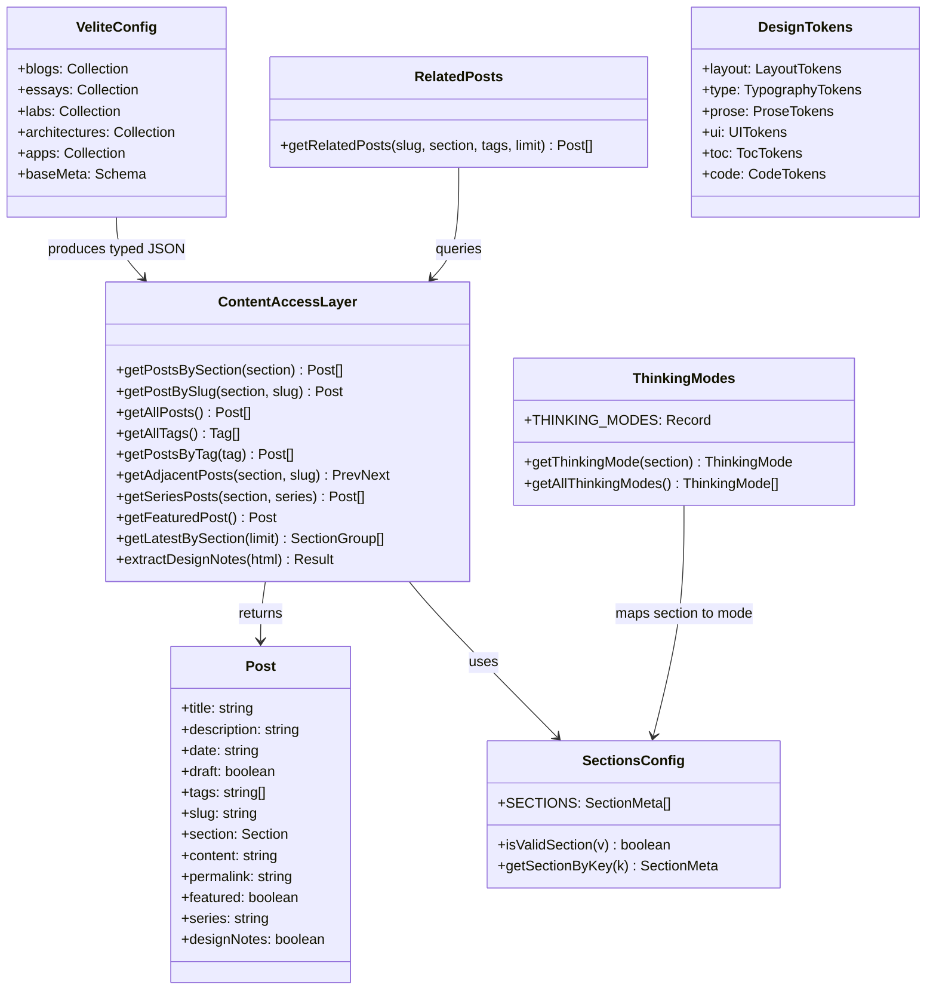
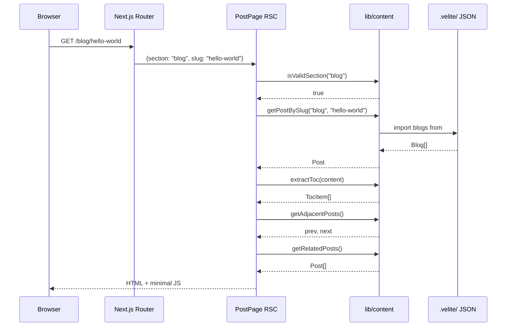
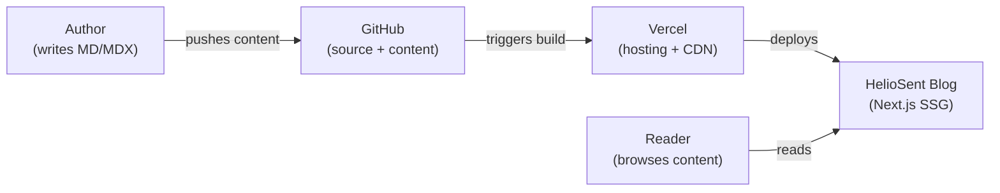
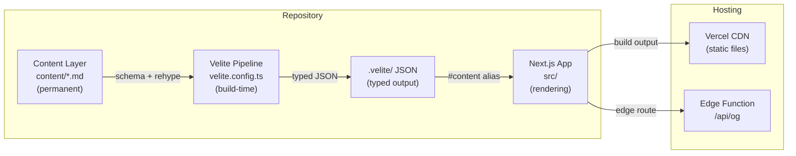
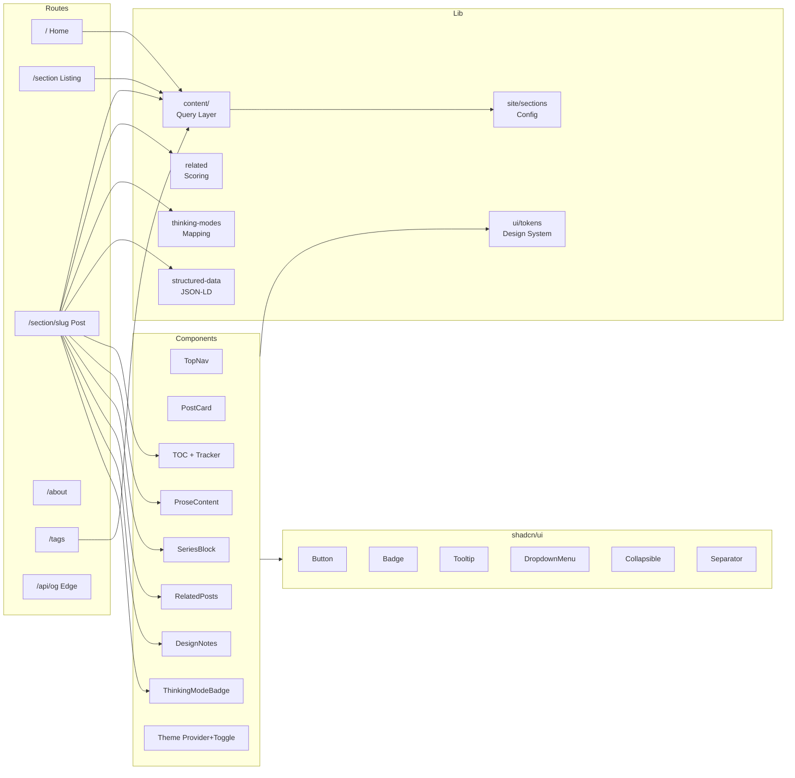

# HelioSent Project Architecture Analysis

> **Thinking Mode: Philosophical Mode**
> v1.1 | Generated 2026-02-16 | Based on commit `b7fe088`

---

## System Context

HelioSent is a personal engineering knowledge system. It captures structured thinking across five cognitive modes — philosophy, experimentation, system architecture, product execution, and incremental learning — with a deliberate separation between permanent content and disposable rendering infrastructure.

The architectural posture is **content-sovereign**: the `content/` directory is designed to survive any framework migration. The rendering layer (Next.js) is explicitly considered replaceable.

---

## 0. Executive Summary

| Dimension | Assessment |
|-----------|------------|
| **System Purpose** | Structured knowledge system with "Thinking Modes" as the organizing metaphor |
| **Maturity Level** | Early-stage (v0.1.0). 4 content files, 9 commits. Core architecture established |
| **Technical Risk** | Low complexity risk. High operational risk — no CI/CD, no tests, no environment documentation |
| **Architectural Strength** | Clean 3-layer separation (Content → Pipeline → Rendering). Locked design token system. Consistent patterns across 55 source files |

---

## 1. Project Overview

### System Description

A statically-generated blog/knowledge base built with Next.js 16 App Router. Content is authored in Markdown/MDX, processed at build-time by Velite into typed JSON, and rendered via React Server Components. Five content sections each map to a "Thinking Mode" representing a distinct cognitive posture.

### Primary Use Cases

1. Publish structured writing across five sections (essays, blog, labs, architecture, apps)
2. Navigate by thinking mode — readers understand the intent behind content
3. Browse by tags — cross-cutting taxonomy across all sections
4. Share with rich previews — dynamic OG image generation per post

### Scope Boundaries

- No user authentication or multi-author support
- No database — all data is build-time static
- No comments, reactions, or social features
- No CMS — content is authored as files in the repository
- No search functionality
- No RSS/Atom feed
- No i18n framework (Korean locale hardcoded in utilities)

---

## 2. Technology Stack

| Category | Technology | Evidence |
|----------|-----------|----------|
| **Language** | TypeScript 5 (strict) | `tsconfig.json` — `"strict": true` |
| **Runtime** | Bun | `bun.lock`, `package.json` scripts |
| **Framework** | Next.js 16.1.6 (App Router) | `package.json` |
| **UI Library** | React 19.2.3 | `package.json` |
| **Content Pipeline** | Velite 0.3.1 | `velite.config.ts`, `#content` path alias |
| **Styling** | Tailwind CSS 4 + PostCSS | `postcss.config.mjs`, `globals.css` |
| **Design System** | shadcn/ui (new-york style) | `components.json`, `src/components/ui/` |
| **Component Library** | Radix UI 1.4.3 | `package.json`, all `ui/` components |
| **Variant System** | class-variance-authority (cva) | `button.tsx`, `badge.tsx` |
| **Class Utility** | clsx + tailwind-merge | `src/lib/utils.ts` |
| **Theme** | next-themes 0.4.6 | `theme-provider.tsx`, `theme-toggle.tsx` |
| **Icons** | lucide-react 0.564.0 | TopNav, CopyButton, PostNavigation |
| **Syntax Highlighting** | Shiki via @shikijs/rehype | `velite.config.ts` — dual theme (github-light/dark) |
| **Markdown Processing** | rehype-slug, rehype-autolink-headings | `velite.config.ts` |
| **Animation** | tw-animate-css | `globals.css` |
| **Font** | Geist + Geist Mono (Google Fonts) | `layout.tsx` |
| **Color Space** | oklch | `globals.css` — all CSS variables |
| **Linting** | ESLint 9 (core-web-vitals + TypeScript) | `eslint.config.mjs` |
| **Testing** | None configured | — |
| **CI/CD** | None configured | — |
| **Deployment** | Vercel (implicit) | `.gitignore` includes `.vercel` |

---

## 3. Project Structure

### Root Layout

```
heliosent-blog/
├── content/                 # Permanent content layer (MD/MDX)
│   ├── apps/
│   ├── architecture/
│   ├── blog/
│   ├── essays/
│   └── labs/
├── public/                  # Static assets
│   └── static/              # Velite-generated assets (hashed)
├── src/                     # Application source
│   ├── app/                 # Next.js App Router (routes, layouts)
│   ├── components/          # Feature + UI components
│   │   └── ui/              # shadcn/ui primitives (Radix-based)
│   └── lib/                 # Utilities, content access, tokens
│       ├── content/         # Content query layer
│       ├── site/            # Section definitions
│       └── ui/              # Design tokens
├── .velite/                 # Build output — typed content JSON (gitignored)
├── velite.config.ts         # Content schema & pipeline config
├── next.config.ts           # Next.js config (empty — defaults)
├── components.json          # shadcn/ui config
├── tsconfig.json            # TypeScript (strict, path aliases)
├── postcss.config.mjs       # Tailwind CSS 4
└── eslint.config.mjs        # ESLint (Next.js presets)
```

### Module Boundaries

| Layer | Directory | Responsibility | Dependency Direction |
|-------|-----------|---------------|---------------------|
| **Content** | `content/` | Raw Markdown/MDX files | Independent — no code imports |
| **Pipeline** | `velite.config.ts` → `.velite/` | Schema validation, type generation, HTML transform | Reads content, produces typed JSON |
| **Data Access** | `src/lib/content/` | Query functions over Velite output | Imports from `#content` (`.velite/`) |
| **Domain Logic** | `src/lib/` | Sections, thinking modes, related posts, tokens | Pure functions, no framework deps |
| **UI Primitives** | `src/components/ui/` | shadcn/ui components (Radix wrappers) | Only depends on `@/lib/utils` |
| **Feature Components** | `src/components/` | Blog-specific components | Depends on lib + ui |
| **Routes** | `src/app/` | Pages, layouts, API routes | Composes components + lib |

---

## 4. Development Workflow

### Setup & Install

```bash
bun install
```

### Commands

| Command | Description |
|---------|-------------|
| `bun run dev` | Velite watcher + Next.js dev server (concurrent) |
| `bun run build` | Velite content build → Next.js static build |
| `bun run start` | Serve production build |
| `bun run lint` | ESLint check |

### Environment Variables

| Variable | Purpose | Default |
|----------|---------|---------|
| `NEXT_PUBLIC_SITE_URL` | Base URL for metadata/OG/JSON-LD | `https://heliosent.com` |
| `SHOW_DRAFTS` | Show draft posts (`"true"` to enable) | Not set |
| `NODE_ENV` | Controls draft visibility in production | `production` |

No `.env.example` exists.

### Deployment

No CI/CD workflows configured. Deployment is implicitly via Vercel Git integration.

### IDE Support

- **VS Code**: Debug configs in `.vscode/launch.json`
- **Cursor**: Project rules in `.cursor/rules/`
- **AI Agent docs**: Hierarchical `AGENTS.md` at each directory level

---

## 5. Architecture Analysis

### Request Flow

```
1. Browser requests URL
2. Next.js App Router matches route:
   /                       → app/page.tsx
   /about                  → app/about/page.tsx
   /tags                   → app/tags/page.tsx
   /tags/[tag]             → app/tags/[tag]/page.tsx
   /[section]              → app/[section]/page.tsx
   /[section]/[slug]       → app/[section]/[slug]/page.tsx
   /api/og                 → app/api/og/route.tsx (Edge)
3. Route calls lib/content query functions
4. lib/content reads typed JSON from .velite/ via #content alias
5. RSC renders HTML
6. Client components hydrate only where needed
```

### Client-Side State (Minimal)

| State | Mechanism | Component |
|-------|-----------|-----------|
| Theme | next-themes (localStorage + class) | ThemeProvider, ThemeToggle |
| Active TOC heading | IntersectionObserver | TocActiveTracker |
| Copy feedback | useState | CopyButton, ProseContent |
| Mobile nav | Radix DropdownMenu internal | TopNav |

### Build-Time Data Flow

```
content/*.md → Velite (schema + rehype) → .velite/*.json → TypeScript types
```

### Extension Points

1. **New section**: `velite.config.ts` → `site/sections.ts` → `thinking-modes.ts` → `content/<section>/`
2. **New shadcn component**: `npx shadcn@latest add <name>`
3. **New page**: `src/app/<route>/page.tsx`
4. **New content field**: `baseMeta` in `velite.config.ts` → `Post` in `types.ts`

### Architectural Tradeoffs

| Decision | Benefit | Cost |
|----------|---------|------|
| Velite over Contentlayer | Active maintenance, Zod-based schema | Less mature, `as any` cast for Shiki type conflict |
| Full SSG | Zero-runtime data cost | Must rebuild for content changes |
| No database | No operational burden | No dynamic features |
| Content-first separation | Framework migration resilience | Extra build step |
| Locked design tokens as TS consts | Single source of truth | No Tailwind IntelliSense for token values |
| oklch color space | Perceptually uniform | Older browser support uncertain |

---

## 6. Functional Specification

| Feature | Entry Point | Status |
|---------|-------------|--------|
| Home page (featured + latest by section) | `app/page.tsx` | Implemented |
| Section listing | `app/[section]/page.tsx` | Implemented |
| Post detail (TOC, series, related, design notes) | `app/[section]/[slug]/page.tsx` | Implemented |
| About page (thinking mode index) | `app/about/page.tsx` | Implemented |
| Tags index | `app/tags/page.tsx` | Implemented |
| Tag filter | `app/tags/[tag]/page.tsx` | Implemented |
| OG image generation (Edge) | `app/api/og/route.tsx` | Implemented |
| Theme switching (dark/light/system) | ThemeProvider, ThemeToggle | Implemented |
| Thinking mode badges (color-coded, tooltips) | ThinkingModeBadge, ThinkingModesStrip | Implemented |
| Table of contents (desktop + mobile) | toc.tsx, toc-active-tracker.tsx | Implemented |
| Code syntax highlighting (dual-theme Shiki) | velite.config.ts, globals.css | Implemented |
| Series navigation | SeriesBlock | Implemented |
| Related posts (score-based) | RelatedPosts, related.ts | Implemented |
| Design notes (collapsible) | DesignNotes | Implemented |
| JSON-LD structured data | ArticleJsonLd | Implemented |
| Prev/Next navigation | PrevNext | Implemented |
| Draft support | lib/content isPublished | Implemented |
| Responsive navigation | TopNav (desktop + mobile dropdown) | Implemented |
| RSS/Atom feed | — | Not implemented |
| Full-text search | — | Not implemented |
| Sitemap | — | Not implemented |
| Custom 404 page | — | Not implemented |

---

## 7. Non-Functional Characteristics

### Observed

| Category | Observation | Evidence |
|----------|-------------|----------|
| **Performance** | Full SSG. 5 of ~25 components use `"use client"` | `generateStaticParams` on all dynamic routes |
| **Security** | No user input, no database, no auth | Minimal attack surface |
| **Accessibility** | Radix UI ARIA compliance. `aria-label` on interactive elements | All shadcn components, TopNav, CopyButton |
| **SEO** | OG + Twitter Card metadata. JSON-LD Article. Heading anchors | `generateMetadata`, `ArticleJsonLd` |
| **Theming** | oklch variables for light/dark. Class-based dark mode | `globals.css` `:root` and `.dark` |
| **Typography** | Tailwind Typography plugin with custom prose tokens | `ui/tokens.ts` |
| **Design Consistency** | Locked token system | `tokens.ts` header: "DO NOT modify" |

### Recommended

| Category | Recommendation | Priority |
|----------|---------------|----------|
| **Testing** | Vitest for `lib/content/` and `lib/related.ts` | High |
| **CI/CD** | GitHub Actions: lint → build → deploy | High |
| **SEO** | Generate `robots.txt` and `sitemap.xml` | Medium |
| **Monitoring** | Vercel Analytics or Plausible | Medium |
| **Feed** | RSS/Atom for content syndication | Low |
| **Environment** | Create `.env.example` | Low |

---

## 8. Risks & Improvement Opportunities

### Immediate (1-3 days)

| Item | Impact | Complexity |
|------|--------|------------|
| No CI/CD — broken builds deploy silently | High | Low |
| No tests — content query logic has no safety net | High | Low |
| No `.env.example` | Medium | Trivial |
| Duplicate `formatDate` in `lib/content/index.ts` and `post-card.tsx` | Low | Trivial |

### Short Term (1-2 weeks)

| Item | Impact | Complexity |
|------|--------|------------|
| No sitemap.xml or robots.txt | Medium | Low |
| No RSS/Atom feed | Medium | Low |
| No search | Medium | Medium |
| Unused components (`SiteHeader`, `SectionNav`, `PostNavigation`, `FeaturedCard`, `CodeBlock`) | Low | Low |

### Mid Term (1-2 months)

| Item | Impact | Complexity |
|------|--------|------------|
| No image optimization (`cover` field unused with `next/image`) | Medium | Medium |
| No analytics/monitoring | Medium | Low |
| Velite ecosystem risk (v0.3.1) | Medium | High |

---

## 9. Architecture Diagrams

### UML — Component / Class



### UML — Sequence (Post Detail)



### C4 — System Context



### C4 — Container



### C4 — Component (Next.js App)



---

## 10. Evidence & Verification Paths

### Key Files Referenced

| File | Role |
|------|------|
| `package.json` | Dependencies, scripts, version |
| `tsconfig.json` | Strict config, path aliases `@/*`, `#content` |
| `velite.config.ts` | 5 collections, baseMeta schema, Shiki, rehype |
| `next.config.ts` | Empty — all defaults |
| `components.json` | shadcn/ui new-york, RSC, aliases |
| `src/app/globals.css` | oklch theme, Shiki dark mode, code styles |
| `src/lib/ui/tokens.ts` | Locked design system v1.1 |
| `src/lib/content/index.ts` | 17 content query exports |
| `src/lib/content/types.ts` | Post interface, VelitePost union |
| `src/lib/site/sections.ts` | 5 sections with thinking modes |
| `src/lib/thinking-modes.ts` | Mode definitions and color mapping |
| `src/lib/related.ts` | Scoring: section +10, tag +3, recency +1 |
| `src/lib/structured-data.tsx` | JSON-LD Article |
| `src/app/layout.tsx` | Root: Geist fonts, ThemeProvider, TopNav |
| `src/app/[section]/[slug]/page.tsx` | Most complex route (12 imports) |
| `content/architecture/blog-structure-concept.md` | Architecture intent document |

### Verification Required

| Area | Verification Path |
|------|------------------|
| Deployment target | Check Vercel dashboard or `vercel.json` |
| Additional env vars | Check Vercel project settings |
| Build passes | Run `bun run build` |
| Unused components | Grep `SiteHeader`, `FeaturedCard`, `CodeBlock` imports in `app/` |

---

## Design Notes

### Notable Patterns

1. **Thinking Modes as identity**: Sections carry cognitive semantics (philosophical, experimental, system, product, update), not just taxonomy.

2. **Locked design tokens**: `src/lib/ui/tokens.ts` centralizes all spacing, typography, and component styles as immutable TypeScript string constants.

3. **Content-pipeline boundary**: The `#content` path alias ensures application code never reads `.md` files — only typed JSON from `.velite/`.

4. **RSC-first**: 5 of ~25 components use `"use client"`. Client boundary pushed to minimum: theme, TOC tracking, copy buttons, mobile nav.

5. **Design notes as content feature**: Posts include `<DesignNotes>` blocks extracted via regex into collapsible `<details>` — meta-commentary on the post itself.

### Deviations

1. **`type` as export name** in `tokens.ts` shadows the TypeScript keyword. Aliased as `t` at import sites.

2. **Duplicate navigation components**: `SiteHeader` + `SectionNav` (potentially legacy) alongside `TopNav` (active in layout). `PostNavigation` and `PrevNext` serve the same purpose with different APIs.

3. **`as any` in Velite config**: Known type conflict between Velite's unified types and @shikijs/rehype, documented with ESLint disable comment.

### Architectural Intent

From `content/architecture/blog-structure-concept.md`:

> "Framework는 바뀌어도 content는 유지되어야 한다."
> "Rendering layer는 disposable, Content layer는 permanent."

The separation of `content/` from `src/` is a deliberate long-term resilience strategy against framework churn.
